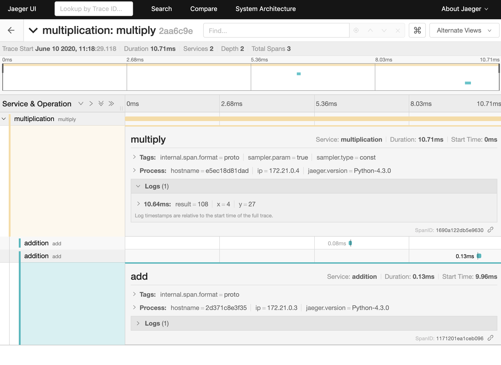
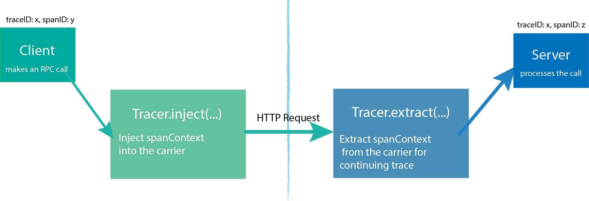

# Distributed Tracing with Jaeger

Distributed tracing, also called distributed request tracing, is a method used to profile and monitor applications, especially those built using a microservices architecture. Distributed tracing helps pinpoint where failures occur and what causes poor performance.

## How to run locally

You can run this application locally with docker-compose. `docker-compose up` command would run the following three containers.

1. `addition` container. This service gets two integers from `x` and `y` query string and returns sum of them.
2. `multiplication` container. This service get two integers from `x` and `y` query string and returns product of them. It uses `addition` service to calculate the result.
3. `jaeger` container. You can check the trace on `http://localhost:16686/`

## Propagating a Trace with Inject/Extract

In order to trace across process boundaries in distributed systems, services need to be able to continue the trace injected by the client that sent each request. That's why `multiplication` service injects its context to the HTTP request and `addition` service extracts it.

Source: [OpenTracing.io](https://opentracing.io/docs/overview/tracers/)